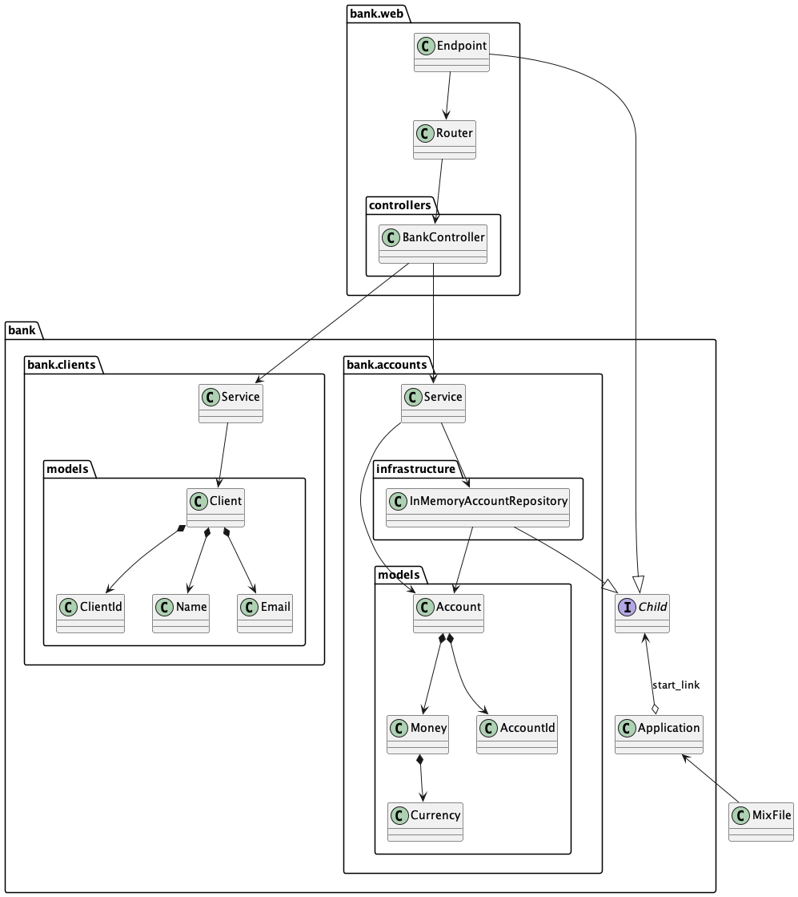

# Bank

## Architecture

## Fun list

- [ ] use cases

  - [x] create account
  - [x] deposit money
  - [x] withdraw money
  - [ ] transfer money

- [ ] http api

  - [x] Users can create accounts
  - [ ] Users can deposit money
  - [ ] Users can withdraw money
  - [ ] Users can transfer money between accounts

- [x] Accounts have a currency
- [ ] Users are the owners of accounts
- [ ] Removing users should close all accounts
- [ ] Use case to create a new user with a new account
- [ ] Users have a credit score [0-100%]
- [ ] Initial credit score is 100
- [ ] Users with balance > 0 can request a loan for up to 100% of their balance
- [ ] Loans reduce the credit score by the percentage of the loan amount relative to the user's balance
      (ie: 500 loan on a 1000 balance reduces the credit score by 50%)
- [ ] A user with a loan cannot close their last account
